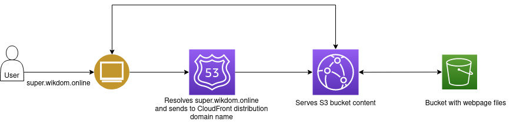

# BHT app https://super.wikdom.online/
App is hosted on S3 bucket and served by CloudFormation. Direct access to bucket website is not allowed
### Overall architecture

* App file are hosted in S3 bucket (bucket is private)
* CloudFront configured with [OAC](https://aws.amazon.com/blogs/networking-and-content-delivery/amazon-cloudfront-introduces-origin-access-control-oac/)
* DNS zone in Route53
* super.wikdom.online is CNAME record for CloudFront origin domain name.
* TLS certs (issued by ACM) for super.wikdom.online

### Installation
NB! No ClickOps, all services are created with IaC tool - Terraform.
Terraform execution comes through Terraform Cloud (no local execution!).
State file are also in TF Cloud.

For infrastructure provisioning you should have an access to TF Cloud to X organization and to AWS Account.
Some variables, such as region, AWS Access key ID and Secret Access key, are added to TF Cloud Workspace variables.

TF Cloud triggers Plan and Apply for changes in TF files.